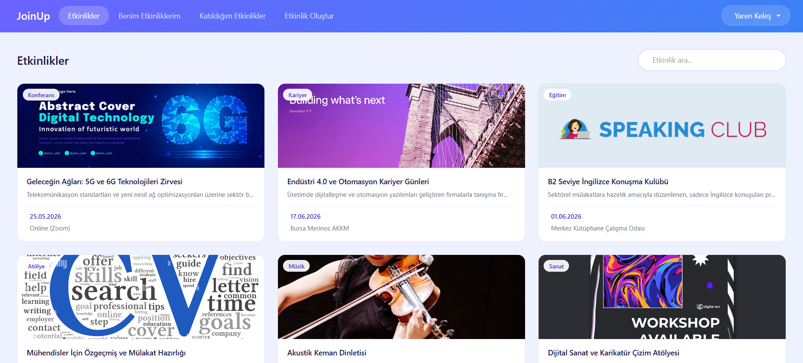
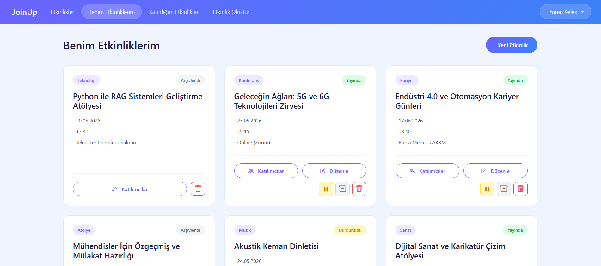
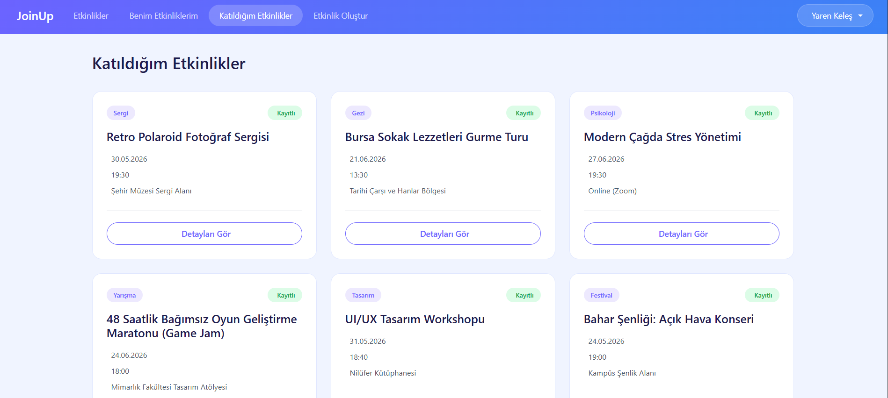

# 🚀 JoinUp - Etkinlik Planlama Uygulaması

JoinUp, kullanıcıların etkinlik oluşturabildiği, etkinliklere katılım sağlayabildiği ve kendi etkinliklerini yönetebildiği bir web uygulamasıdır. Proje kapsamında backend ve frontend teknolojileri kullanılarak katmanlı mimariye uygun bir sistem geliştirilmiştir. Bu repository, JoinUp uygulamasının Angular tabanlı frontend projesidir. Uygulama, kullanıcıların etkinlikleri görüntülemesine, yönetmesine ve sisteme kayıt olup giriş yapabilmesine olanak tanıyan, Bootstrap ile tasarlanmış modern bir arayüz sunar.

## Kullanılan Teknolojiler
* Angular
* Bootstrap


 ## Proje Özellikleri

- Kullanıcı kayıt ve giriş işlemleri 
- Etkinlik oluşturma, güncelleme, silme ve arşivleme  
- Etkinlik listeleme ve arama  
- Sayfalama desteği ile etkinlik görüntüleme  
- Etkinlik katılım takibi  
- Kullanıcı bazlı etkinlik yönetimi  

## Kurulum 
### 1. Ön Gereksinimler

Projenin çalışması için sisteminizde Node.js ve Angular CLI yüklü olmalıdır.

### 2. Projeyi Klonlayın

```bash
git clone https://github.com/yarenkeles1/Event-Planner-Frontend
cd event-planner-app-frontend
   ```

### 3. Gerekli kütüphaneleri yükleyin

```bash
npm install
   ```

## 4. Uygulamayı Çalıştırın

```bash
ng serve
   ```

## Uygulama Ekran Görüntüleri

### Ana Ekran


### Benim Etkinliklerim Ekranı


### Katıldığım Etkinlikler Ekranı

